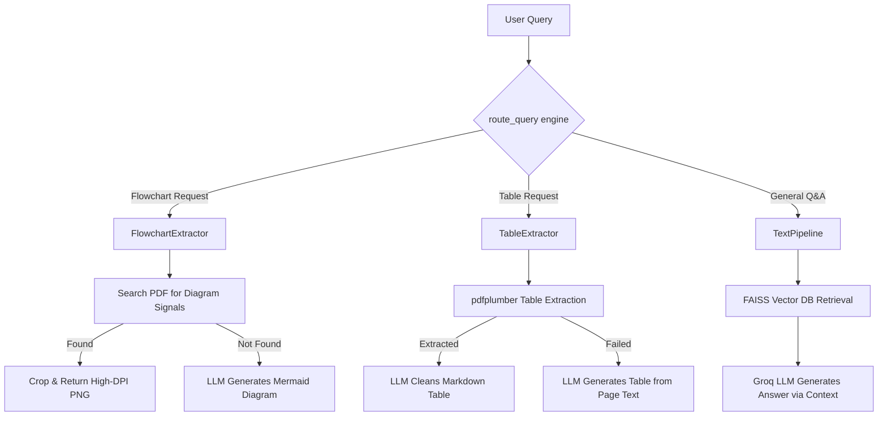

# Quality SOP RAG Pipeline & Chat Assistant

An advanced Retrieval-Augmented Generation (RAG) system specifically designed for processing and interacting with Quality Standard Operating Procedure (SOP) PDF documents. The system provides intelligent text Q&A, structured table extraction, and visual flowchart retrieval.

---

## 🌟 Key Features & Pipelines

The application is built around three intelligent pipelines, all connected to a powerful Groq LLM (`llama-3.3-70b-versatile`) for context-aware processing:

### 1. 💬 Question & Answer Pipeline (`text_pipeline.py`)
- **Semantic Search**: Text is split into chunks and embedded using `sentence-transformers/all-MiniLM-L6-v2`.
- **Retrieval**: Uses a local FAISS vector database to retrieve highly relevant context.
- **LLM Synthesis**: The Groq LLM synthesizes an accurate, purely context-driven answer. By design, if the answer is not in the documents, it clearly states so rather than hallucinating.

### 2. 📊 Intelligent Table Extraction (`table_extractor.py`)
- **Deterministic First**: Uses `pdfplumber` to accurately parse raw table structures from the PDFs.
- **Multi-page Merging**: Automatically detects tables spanning multiple adjacent pages and stitches them seamlessly into a single table.
- **LLM Cleaning (`✨ AI-Refined`)**: The raw markdown table is passed to the LLM to clean up OCR errors, merge awkward headers, and format it perfectly.
- **LLM Fallback (`✨ AI-Generated`)**: If the deterministic extractors fail, the system reads the raw text of the target page and asks the LLM to construct a brand new markdown table representing the data.

### 3. 🗺️ Flowchart & Process Diagram Extraction (`flowchart_extractor.py`)
- **Smart Visual Ranking**: Identifies true flowchart pages by analyzing the density of vector paths (`draw_count`) and bounding boxes (`image_rects`), effectively ignoring cover pages or text-heavy Table of Contents pages. RACI matrices are penalized to ensure they don't get mistaken for flowcharts.
- **High-DPI Cropping**: Automatically zooms in and renders the specific bounding box around the diagram at 3x DPI to provide a clean, high-resolution PNG, ignoring empty page margins.
- **LLM Fallback (`📊 AI-Generated Mermaid`)**: If no visual flowchart image exists in the document, the Groq LLM reads the procedure's step-by-step text and generates a valid `Mermaid.js` structural flowchart to render in the UI.

---

## 🏗️ Architecture



## 🚀 Setup & Installation

**1. Clone the repository and setup directories:**
Ensure you have your SOP PDFs placed in the `pdfs/` directory.

**2. Configure Environment Variables:**
You must configure your API keys. Create a `.env` file in the root directory:
```env
GROQ_API_KEY=your_groq_api_key_here
GROQ_MODEL=llama-3.3-70b-versatile
LLM_PROVIDER=groq
```

**3. Install Dependencies:**
Using Python 3.10+, run:
```bash
pip install -r requirements.txt
```

**4. Build the Vector Index:**
You only need to run this once initially, or whenever you add/change the PDFs in the `pdfs/` folder.
```bash
python main.py --index
```

## 💻 Running the Application

### Option 1: Streamlit Chat UI (Recommended)
This provides a modern chat interface with interactive Mermaid diagrams, rendered dataframes for tables, and inline images for flowcharts.
```bash
streamlit run streamlit_app.py
```

### Option 2: Command Line Interface (CLI)
For quick testing and headless environments:
```bash
python main.py --query "What is the procedure for handling non-conforming products?"
```

## 📝 Example Queries to Try in Streamlit
- **Text:** *"How do I onboard a new supplier?"*
- **Tables:** *"Show me the RACI matrix for the procurement process."*
- **Flowcharts:** *"Provide the workflow diagram for internal audits."*
